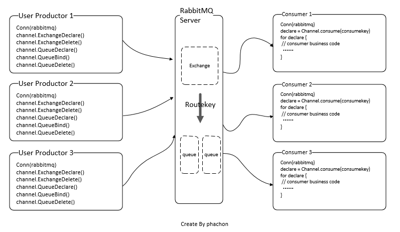
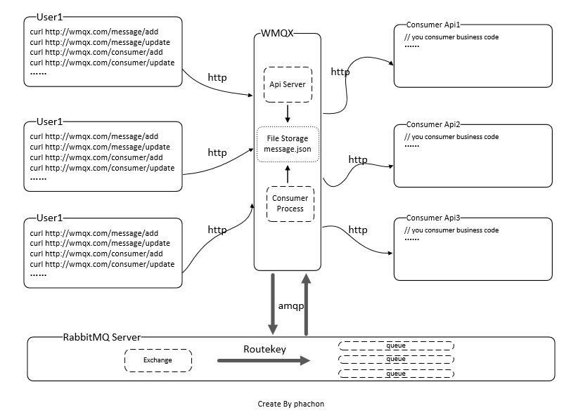

[](https://github.com/phachon/wmqx)

[](https://github.com/phachon/wmqx/) 
[](https://travis-ci.org/phachon/wmqx)
[](https://godoc.org/github.com/phachon/wmqx)
[](https://raw.githubusercontent.com/phachon/wmqx/master/LICENSE)
[](https://goreportcard.com/report/github.com/phachon/wmqx)
[]()
[](https://github.com/phachon/wmqx/releases) 
[](https://github.com/phachon/wmqx/releases) 

WMQX is a support http protocol MQ service based on RabbitMQ development, his predecessor was [wmq](https://github.com/snail007/wmq), Because of the differences in code architecture and implementation, a new project is created called WMQX. I am here to thank his author and my friend [snail007](https://github.com/snail007). Of course, you can also understand that WMQX is an enhanced version of wmq.

[中文文档](README_CN.md)

# Why need WMQX?
RabbitMQ is a lightweight messaging queue middleware that is easy to deploy locally and in the cloud and supports multiple messaging protocols. RabbitMQ can be used in many scenarios and supports multiple language SDK. Usually you use RabbitMQ like this: 

1. As a productor：
    - Write code to connect to RabbitMQ and open a channel.
    - Write code to declare an exchange and set related properties.
    - Write code to declare a queue and set the associated properties.
    - Writing code USES routing key to establish a binding relationship between exchange and queue.
    - Write code to send messages to RabbitMQ.
2. As a consumer：
    - Write code to connect to RabbitMQ, open a channel, start the consuming process, wait for the message to be received, and process the consuming business logic.
    
As shown in the figure below:
[](https://github.com/phachon/wmqx)

### Problems encountered：
1. RabbitMQ connections, Exchange, Queue declarations and modifications are coupled with business code, increasing the cost of development and maintenance.
2. When modifying the consumer's business logic, you may need to restart the consumption process frequently.
3. For first-time users of MQ, it takes time and labor to understand how RabbitMQ works and write code for production and consumption.
4. ...

### Solution and implementation：
1. Pull out the connection of RabbitMQ, the declaration of Exchange, Queue and other non-business operations to provide services separately, and the operation of Exchange and Queue is provided to users in a friendly API.
2. To help the user implement the consuming process of each message, the user only needs to provide the API interface of the consumer, and the consuming process calls the corresponding consumer API after waiting for the message. The consumer business logic changes, only the API needs to be modified, and the consumer process does not need to be restarted.
3. For the first time using the MQ or not clear the principle of the RabbitMQ users, don't need to understand the use of the RabbitMQ and coded, need only through the HTTP access services, can be quickly using the message queue.

> So WMQX was born. The working principle is as follows:

[](https://github.com/phachon/wmqx)

## Feature
1. There is no need to connect to RabbitMQ, providing a high-performance, highly available HTTP interface to manage messages
2. To help users realize the consumption process, they only need to add the corresponding consumer API through the interface to realize the consumption or message push
3. Each consumer is handled by a separate goroutine, and consumers consume each other independently
4. Simple and convenient deployment, support cross-platform deployment, low use and access costs
5. Provide a complete set of background management UI, see [WMQX-UI](https://github.com/phachon/wmqx-ui)

## Install

### RabbitMQ
If you don't have a RabbitMQ service, you'll need to install it yourself, which is pretty simple, see [http://www.rabbitmq.com/download.html](http://www.rabbitmq.com/download.html)

### WMQX
Download the latest binary from [https://github.com/phachon/wmqx/releases](https://github.com/phachon/wmqx/releases)
```shell
# Unpack 
$ tar -zxvf wmqx.tar.gz
```

## Start Run

```
# The default configuration file USES wmqx.conf in the current directory
$ cp config.toml wmqx.conf

# config wmqx.conf
[rabbitmq]
host = "RabbitMQ Server Ip"
port = 5672
username = "test"
password = "123456"
vhost = "/"

# start run
$ ./wmqx 
# Of course, you can also specify the configuration file path to start
$ ./wmqx --conf wmqx.conf
```

## Using document

[Manage message documents](https://github.com/phachon/wmqx/wiki)

[Publish message example](./docs/publish)

## Contribution

see [Contribution](https://github.com/phachon/wmqx/graphs/contributors)

## Feedback

- If you like the project, please [Start](https://github.com/phachon/wmqx/stargazers).
- If you have any problems in the process of use, welcome submit [Issue](https://github.com/phachon/wmqx/issues).
- If you find and solve bug, welcome submit [Pull Request](https://github.com/phachon/wmqx/pulls).
- If you want to redevelop, welcome [Fork](https://github.com/phachon/wmqx/network/members).
- If you want to make a friend, welcome send email to [phachon@163.com](mailto:phachon@163.com).

## License

MIT

Thanks
---------
Create By phachon@163.com